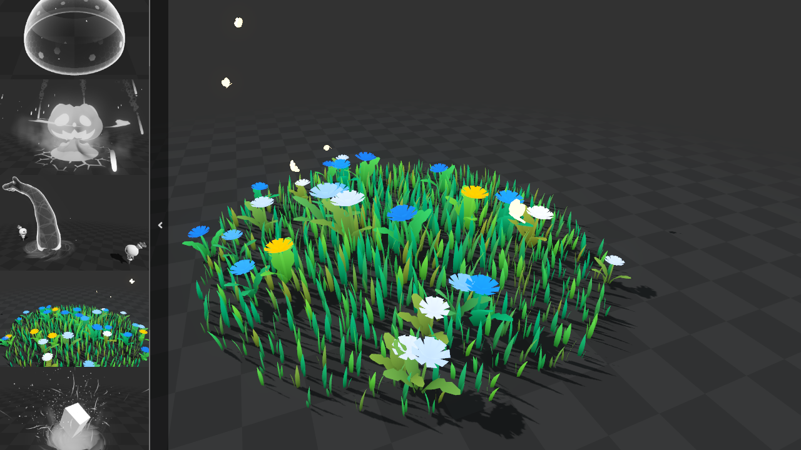

# VFX sketchbook

A collection of VFX created with Godot 4.x, exploring the software’s visual capabilities. Please note that this project gathers quick visual ideations, code and shaders may not be optimal.

### Can I use it in a project?

This project is licensed under the [MIT License](https://opensource.org/license/mit/), a clear credit to the author of the source material is welcomed.

`"VFX name" from [VFX sketchbook](https://github.com/gtibo/VFX-sketchbook) by Thibaud Goiffon`

### Credits

Sky shader: [Gdquest’s Stylized Sky](https://github.com/gdquest-demos/godot-4-stylized-sky)\
Shader utility methods: [Godot shaders’s snippet page](https://godotshaders.com/snippet/useful-code-snippets/)\
Rotation matrix: [Shadertoy Tutorial Part 8 - 3D Rotation](https://inspirnathan.com/posts/54-shadertoy-tutorial-part-8#rotation-matrices)
